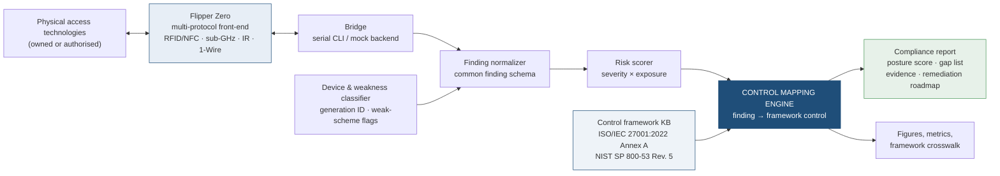
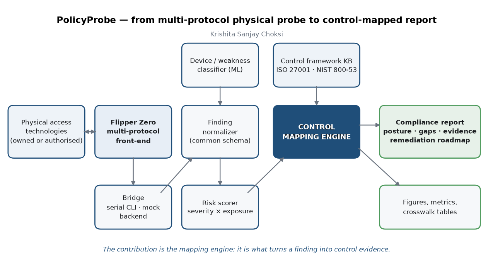
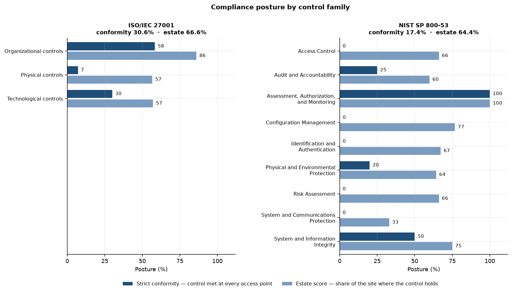
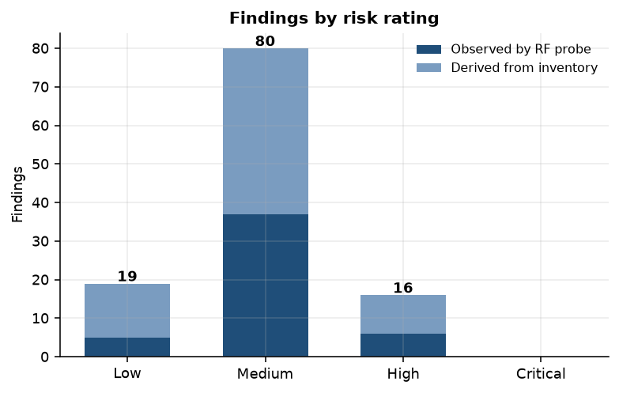
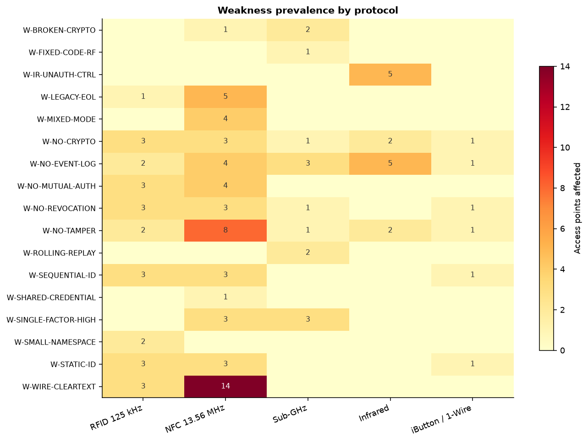
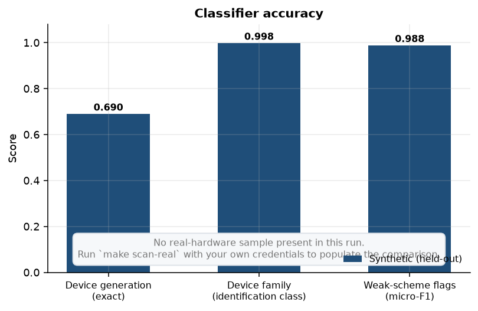
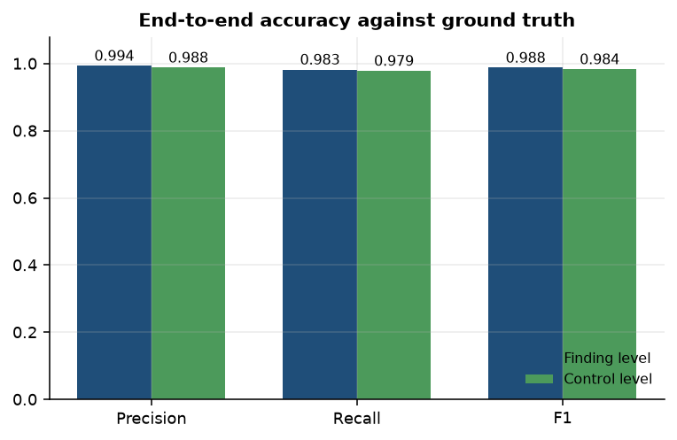
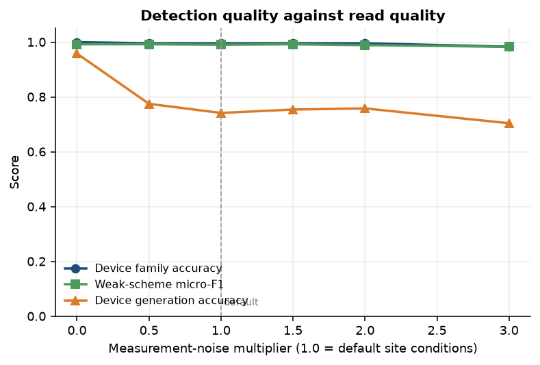
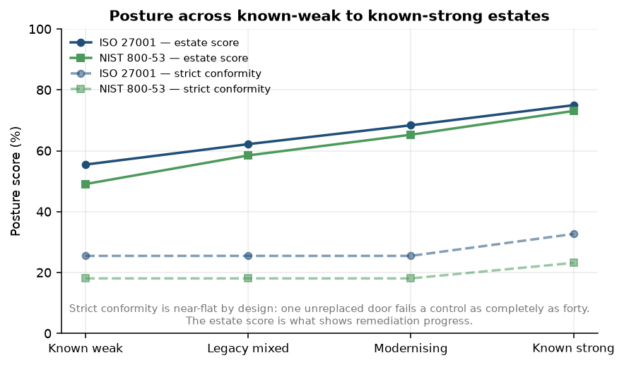
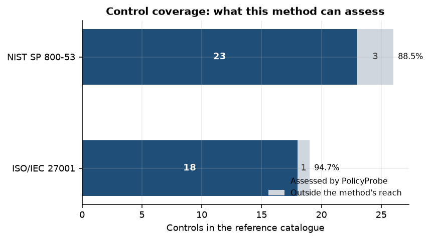

# PolicyProbe — Flipper Zero Physical-Security Compliance Scanner

**Audit the access technologies in a building with a Flipper Zero. Get back a compliance
report mapped to ISO/IEC 27001 and NIST SP 800-53 controls.**

A physical-security auditor that probes RFID/NFC, sub-GHz, IR and iButton/1-Wire access
control with a Flipper Zero, classifies what it finds, and maps every finding to the
specific framework control it provides evidence against — welding hardware RF auditing to a
formal control framework.

Author: **Krishita Sanjay Choksi** · MIT licensed · [Threat model and scope](docs/threat_model.md)

---

## Why this exists

The Flipper Zero community lives almost entirely on the offensive-tinkering side: read this
tag, replay that remote. The GRC world writes physical-security policy and control
checklists, and almost never touches a Flipper. The two barely overlap, and the seam
between them is empty — nobody has built a tool that runs multi-protocol physical-access
audits and outputs a compliance report mapped to an actual control framework.

That gap has a practical cost. An ISO 27001 auditor can confirm that an access control
policy exists, that a badge register is maintained, and that doors have readers on them.
What neither the auditor nor the policy can tell you is whether the credential those
readers accept can be reproduced by anyone who walks past a holder with a reader in their
bag. Control `A.7.2` *Physical entry* is signed off on the presence of a reader, not on
whether that reader can tell a person from a copy of their fob.

PolicyProbe closes that seam. It uses the Flipper as a multi-protocol audit front-end
(RFID/NFC, sub-GHz, IR, iButton/1-Wire) against access-control technologies you own or are
authorised to assess, classifies device generations and flags weak implementations, and —
the part that does not exist anywhere else — maps every finding to the specific control it
provides evidence against, producing an audit-ready report with a posture score, gap list
and remediation roadmap.

**This is a defensive audit tool.** The deliverable is a compliance report, the same
artefact a physical-security assessor hands a client. It does not emulate credentials,
write to blank media, crack keys, or jam anything, and no workflow in it ends in a door
being opened. See [`docs/threat_model.md`](docs/threat_model.md) for the full scope rules.

## What is actually novel here

Flipper protocol tools, feature-based classifiers and control frameworks all exist
separately. The original contributions are:

1. **The finding-to-control mapping.** A concrete, reviewable scheme linking physical-layer
   audit findings to named framework controls, which turns a hack into audit evidence.
   This is the project; everything else exists to feed it. It ships as editable data:
   [`mappings/protocol_weakness_control.yaml`](mappings/protocol_weakness_control.yaml).
2. **A unified multi-protocol finding schema.** One representation across 125 kHz RFID,
   13.56 MHz NFC, sub-GHz, IR and 1-Wire that rolls into a single posture, so a cloneable
   fob, a fixed-code loading-bay remote and an unlogged iButton door land in the same
   report on the same footing.
3. **A weak-implementation flagger** that surfaces replayable, static, sequential and
   no-crypto patterns across every protocol from one feature vector.
4. **A framework-scored physical-security report** — a posture score and gap roadmap tied
   to a real control family, which the Flipper ecosystem has never produced.
5. **A two-score posture model.** Strict conformity answers the audit question; an
   estate-weighted score answers the management question. The distinction turned out to be
   necessary rather than decorative — see [Two scores](#two-scores-and-why).

## Architecture





| Component | Module | What it does |
|---|---|---|
| Flipper front-end | [`src/policyprobe/bridge/`](src/policyprobe/bridge) | Drives the Flipper over its serial CLI with read-only commands. A `mock` backend renders the same observations without hardware, so the whole pipeline runs from a clean clone. |
| Finding normalizer | [`src/policyprobe/normalize/`](src/policyprobe/normalize) | Converts heterogeneous per-protocol results into one finding schema, and separates what was *observed* from what was *derived from inventory*. |
| Classifier | [`src/policyprobe/classify/`](src/policyprobe/classify) | Random forests over interpretable structural features: credential generation, plus weak-scheme flags. |
| Risk scorer | [`src/policyprobe/score/`](src/policyprobe/score) | `severity × zone exposure × modifiers`, all tunable from data. |
| **Control mapping engine** | [`src/policyprobe/mapping/`](src/policyprobe/mapping) | **The contribution.** Maps each finding to the ISO 27001 and NIST 800-53 controls it evidences, and rolls findings into a posture. |
| Report generator | [`src/policyprobe/report/`](src/policyprobe/report) | Posture score, control status, gap list with evidence, remediation roadmap. Markdown + self-contained HTML. |
| Framework KB | [`frameworks/`](frameworks) | Real control IDs and titles; requirement text paraphrased, never reproduced. |

## The mapping table

This is the signature artefact: every weakness the tool can find, the protocols it applies
to, and the controls it fails. `*`-free entries in this table are controls the weakness
*fails outright* — the full mapping, including controls it merely weakens, the rationale
for every row, and the references behind each weakness, is in
[`mappings/protocol_weakness_control.yaml`](mappings/protocol_weakness_control.yaml).

<!-- BEGIN:mapping_table -->
| Protocol | Weakness | Sev. | Detected by | ISO/IEC 27001:2022 controls failed | NIST SP 800-53 Rev. 5 controls failed |
|---|---|---|---|---|---|
| 125 kHz · 13.56 MHz · 1-Wire | **Static, non-authenticating credential identifier**<br/>`W-STATIC-ID` | High | RF probe | `A.7.2`, `A.8.5` | `PE-3`, `IA-3`, `AC-3` |
| 125 kHz · 13.56 MHz · 1-Wire · Sub-GHz · IR | **No cryptographic authentication in the credential exchange**<br/>`W-NO-CRYPTO` | High | RF probe | `A.8.5`, `A.7.2` | `SC-13`, `SC-8`, `PE-3`, `IA-3` |
| 13.56 MHz · Sub-GHz | **Deprecated or academically broken proprietary cipher**<br/>`W-BROKEN-CRYPTO` | High | RF probe | `A.8.5`, `A.8.8` | `SC-13`, `RA-5` |
| 13.56 MHz | **Factory-default or publicly published sector keys in use**<br/>`W-DEFAULT-KEYS` | Critical | RF probe | `A.5.17`, `A.8.5`, `A.7.2`, `A.8.8` | `IA-5`, `CM-6`, `PE-3` |
| Sub-GHz | **Fixed-code sub-GHz transmitter (no rolling code)**<br/>`W-FIXED-CODE-RF` | High | RF probe | `A.7.2`, `A.7.1`, `A.8.5` | `PE-3`, `PE-16`, `SC-8`, `AC-3` |
| Sub-GHz | **Rolling code defeatable by jam-and-replay or counter desynchronisation**<br/>`W-ROLLING-REPLAY` | Medium | RF probe | — | — |
| 125 kHz · 13.56 MHz · 1-Wire | **Sequential or low-entropy identifier allocation**<br/>`W-SEQUENTIAL-ID` | High | RF probe | `A.5.16`, `A.7.2` | `PE-2`, `AC-2`, `PE-3` |
| 125 kHz · 13.56 MHz | **Identifier namespace too small for the credential population**<br/>`W-SMALL-NAMESPACE` | Medium | RF probe | — | — |
| 13.56 MHz · 125 kHz | **Reader is not authenticated to the credential**<br/>`W-NO-MUTUAL-AUTH` | Medium | RF probe | — | — |
| 125 kHz · 13.56 MHz | **Credential data traverses reader-to-controller wiring unauthenticated**<br/>`W-WIRE-CLEARTEXT` | High | Inventory | `A.7.12`, `A.7.2` | `PE-4`, `SC-8`, `PE-3` |
| 125 kHz · 13.56 MHz · Sub-GHz · IR · 1-Wire | **Reader has no tamper detection or no reporting path for tamper events**<br/>`W-NO-TAMPER` | Medium | Inventory | `A.7.4` | `PE-3(5)` |
| 125 kHz · 13.56 MHz · Sub-GHz · IR · 1-Wire | **Access point produces no retained access event record**<br/>`W-NO-EVENT-LOG` | Medium | Inventory | `A.8.15`, `A.7.4` | `AU-2`, `PE-6` |
| 125 kHz · 13.56 MHz · 1-Wire · Sub-GHz | **Credential cannot be expired or revoked at the credential layer**<br/>`W-NO-REVOCATION` | Medium | Inventory | `A.5.18` | `PE-2`, `IA-5` |
| 125 kHz · 13.56 MHz · Sub-GHz · 1-Wire | **Non-attributable shared or pooled credential in use**<br/>`W-SHARED-CREDENTIAL` | Medium | Inventory | `A.5.16` | `AC-2`, `IA-2`, `PE-8` |
| 125 kHz · 13.56 MHz · Sub-GHz · 1-Wire | **Single-factor possession-only credential at a high-sensitivity boundary**<br/>`W-SINGLE-FACTOR-HIGH` | High | Inventory | `A.8.5`, `A.7.3` | `IA-2`, `PE-3(1)` |
| IR | **Security-relevant device controllable by unauthenticated infrared command**<br/>`W-IR-UNAUTH-CTRL` | Medium | RF probe | `A.8.5` | — |
| 125 kHz · 13.56 MHz · 1-Wire | **End-of-life credential or reader generation with no vendor security maintenance**<br/>`W-LEGACY-EOL` | Medium | Inventory | `A.7.13`, `A.8.8` | `RA-5` |
| 13.56 MHz · 125 kHz | **Reader accepts a legacy insecure format alongside the secure format**<br/>`W-MIXED-MODE` | High | RF probe | `A.8.5`, `A.7.2`, `A.8.8` | `CM-6`, `PE-3` |
<!-- END:mapping_table -->

## Framework crosswalk

The same assessment, expressed in either control language. An organisation certified to ISO
27001 and an agency working to NIST SP 800-53 get the same findings in their own terms from
one site visit.

<!-- BEGIN:crosswalk_table -->
| Weakness | Protocols | ISO/IEC 27001:2022 | NIST SP 800-53 Rev. 5 |
|---|---|---|---|
| Static, non-authenticating credential identifier<br/>`W-STATIC-ID` | rfid_lf, nfc_hf, ibutton | `A.7.2*`, `A.8.5*`, `A.5.16`, `A.8.8` | `PE-3*`, `IA-3*`, `AC-3*`, `IA-2`, `RA-5` |
| No cryptographic authentication in the credential exchange<br/>`W-NO-CRYPTO` | rfid_lf, nfc_hf, ibutton, subghz, ir | `A.8.5*`, `A.7.2*`, `A.8.8` | `SC-13*`, `SC-8*`, `PE-3*`, `IA-3*` |
| Deprecated or academically broken proprietary cipher<br/>`W-BROKEN-CRYPTO` | nfc_hf, subghz | `A.8.5*`, `A.8.8*`, `A.7.13`, `A.7.2` | `SC-13*`, `PE-3`, `RA-5*`, `CM-6` |
| Factory-default or publicly published sector keys in use<br/>`W-DEFAULT-KEYS` | nfc_hf | `A.5.17*`, `A.8.5*`, `A.7.2*`, `A.8.8*` | `IA-5*`, `CM-6*`, `PE-3*`, `SC-13` |
| Fixed-code sub-GHz transmitter (no rolling code)<br/>`W-FIXED-CODE-RF` | subghz | `A.7.2*`, `A.7.1*`, `A.8.5*`, `A.7.4` | `PE-3*`, `PE-16*`, `SC-8*`, `AC-3*`, `PE-6` |
| Rolling code defeatable by jam-and-replay or counter desynchronisation<br/>`W-ROLLING-REPLAY` | subghz | `A.7.2`, `A.8.5`, `A.8.8` | `PE-3`, `SC-8`, `PE-6` |
| Sequential or low-entropy identifier allocation<br/>`W-SEQUENTIAL-ID` | rfid_lf, nfc_hf, ibutton | `A.5.16*`, `A.7.2*`, `A.5.15` | `PE-2*`, `AC-2*`, `PE-3*`, `IA-2` |
| Identifier namespace too small for the credential population<br/>`W-SMALL-NAMESPACE` | rfid_lf, nfc_hf | `A.5.16`, `A.7.2`, `A.8.8` | `IA-2`, `AC-2`, `PE-3` |
| Reader is not authenticated to the credential<br/>`W-NO-MUTUAL-AUTH` | nfc_hf, rfid_lf | `A.8.5`, `A.7.9`, `A.7.2` | `IA-3`, `SC-8`, `PE-3` |
| Credential data traverses reader-to-controller wiring unauthenticated<br/>`W-WIRE-CLEARTEXT` | rfid_lf, nfc_hf | `A.7.12*`, `A.7.2*`, `A.8.5`, `A.7.4` | `PE-4*`, `SC-8*`, `PE-3*`, `PE-3(5)` |
| Reader has no tamper detection or no reporting path for tamper events<br/>`W-NO-TAMPER` | rfid_lf, nfc_hf, subghz, ir, ibutton | `A.7.4*`, `A.7.2`, `A.8.16` | `PE-3(5)*`, `PE-6`, `SI-4` |
| Access point produces no retained access event record<br/>`W-NO-EVENT-LOG` | rfid_lf, nfc_hf, subghz, ir, ibutton | `A.8.15*`, `A.7.4*`, `A.8.16` | `AU-2*`, `PE-6*`, `PE-8`, `AU-6` |
| Credential cannot be expired or revoked at the credential layer<br/>`W-NO-REVOCATION` | rfid_lf, nfc_hf, ibutton, subghz | `A.5.18*`, `A.5.16`, `A.7.2` | `PE-2*`, `IA-5*`, `AC-2` |
| Non-attributable shared or pooled credential in use<br/>`W-SHARED-CREDENTIAL` | rfid_lf, nfc_hf, subghz, ibutton | `A.5.16*`, `A.5.18`, `A.8.15` | `AC-2*`, `IA-2*`, `PE-2`, `PE-8*` |
| Single-factor possession-only credential at a high-sensitivity boundary<br/>`W-SINGLE-FACTOR-HIGH` | rfid_lf, nfc_hf, subghz, ibutton | `A.8.5*`, `A.7.3*`, `A.7.2`, `A.5.15` | `IA-2*`, `PE-3(1)*`, `PE-3`, `PE-6(4)` |
| Security-relevant device controllable by unauthenticated infrared command<br/>`W-IR-UNAUTH-CTRL` | ir | `A.7.2`, `A.7.3`, `A.8.5*` | `PE-3`, `AC-3`, `SC-8`, `PE-18` |
| End-of-life credential or reader generation with no vendor security maintenance<br/>`W-LEGACY-EOL` | rfid_lf, nfc_hf, ibutton | `A.7.13*`, `A.8.8*`, `A.5.15` | `RA-5*`, `CM-6`, `PE-3` |
| Reader accepts a legacy insecure format alongside the secure format<br/>`W-MIXED-MODE` | nfc_hf, rfid_lf | `A.8.5*`, `A.7.2*`, `A.8.8*`, `A.5.37` | `CM-6*`, `PE-3*`, `SC-13`, `RA-5` |

`*` marks a control the weakness fails outright; the rest are controls it weakens or provides supporting evidence against.
<!-- END:crosswalk_table -->

## Results

Every number below is produced by `make all` from a clean clone with no hardware attached,
using the seeds in [`config/default.yaml`](config/default.yaml).

<!-- BEGIN:results_summary -->
| Measure | Result | Notes |
|---|---|---|
| Device generation identified exactly | **0.690** | over 17 generations |
| Device identification family correct | **0.998** | over 11 families — this is what drives the mapping |
| Weak-scheme flags (micro-F1) | **0.988** | 10 RF-observable weaknesses |
| Finding detection (F1) | **0.988** | P 0.994 / R 0.983 against ground truth |
| Control assignment (F1) | **0.984** | P 0.988 / R 0.979, both frameworks |
| ISO/IEC 27001 — strict conformity, sample facility | **30.6%** | control met only where it holds at every access point; coverage 94.7% of the catalogue |
| ISO/IEC 27001 — estate score, sample facility | **66.6%** | share of access points at which the control actually holds |
| NIST SP 800-53 — strict conformity, sample facility | **17.4%** | control met only where it holds at every access point; coverage 88.5% of the catalogue |
| NIST SP 800-53 — estate score, sample facility | **64.4%** | share of access points at which the control actually holds |
| Posture ordering weak → strong | **monotonic** | estate score across four labelled estate profiles |
| Knowledge base size | **129 mappings** | 18 weaknesses across 5 protocols |
<!-- END:results_summary -->

### Compliance posture by control family



### Findings by risk rating



### Weakness prevalence by protocol

Which access technologies in the estate carry the most weaknesses, and which weaknesses.



### Classifier accuracy



The interesting result here is the gap between the two device bars. Exact generation
identification is mediocre, and it should be: a T5577 programmed with an EM4100 identifier
*is* an EM4100 on the air, and an NTAG21x used UID-only presents like a MIFARE Ultralight.
Those pairs are not distinguishable from a passive read, and a classifier claiming otherwise
would be lying. What matters for compliance is the **identification family**, because that
is what determines the weakness set and therefore the control mapping — and family accuracy
is near-perfect. Reporting only the family number would overstate the tool; reporting only
the exact number would understate it, so both are reported.

### End-to-end accuracy against ground truth



Control-level accuracy tracks finding-level accuracy closely, which is the expected result:
the mapping is a deterministic lookup, so it introduces no error of its own. What this
measures is how detection error *propagates into the compliance conclusion*, which is the
number that actually matters to an auditor.

### Detection quality against read quality



The weak-scheme flags are close to deterministic on a clean read — if two reads return an
identical payload and no challenge was issued, the credential *is* static, and no cleverness
is involved. So the honest evaluation question is not "how accurate is it?" but "how far can
read quality degrade before the findings, and the control gaps derived from them, stop being
trustworthy?" This curve is that answer.

### Posture ordering



### Control coverage



The tool does not claim to assess controls it cannot reach. Controls outside its method are
reported as *not assessed* and excluded from the posture score rather than scored as
passing — scoring an unassessable control as met would manufacture assurance. The full
per-control coverage list is in [`results/tables/coverage_table.md`](results/tables/coverage_table.md).

## Two scores, and why

An early version of this project reported a single posture score, and it failed a test it
should have passed: a known-weak estate, a half-migrated estate and a well-run estate all
scored within a point of each other.

The cause was not a bug. A control is either met across the site or it is not, so the strict
rollup takes the worst access point — one unreplaced door fails `A.7.2` exactly as
completely as forty do. That is the right answer for a certification audit and the wrong
answer for anyone managing a migration, because the number cannot move until the last door
is finished.

So the report gives both:

* **Conformity** — the share of assessed controls met site-wide. What an auditor certifies.
* **Estate score** — for each control, the share of access points at which it actually
  holds. What shows whether last quarter's remediation spend moved anything.

The gap between the two is the remediation in progress. The [posture ordering
figure](#posture-ordering) shows the two behaving differently on purpose: conformity is
near-flat across estate quality, the estate score separates cleanly.

## Sample compliance report

A complete worked assessment of a synthetic facility — posture score, control status, gap
list with evidence, and a remediation roadmap:

* [`reports/sample_compliance_report.md`](reports/sample_compliance_report.md)
* [`reports/sample_compliance_report.html`](reports/sample_compliance_report.html) — styled, self-contained, prints to PDF from any browser

The facility it describes does not exist. It is generated by
[`src/policyprobe/data/facility.py`](src/policyprobe/data/facility.py) from the seed in
`config/default.yaml`.

## Remediation roadmap

Generated from the knowledge base, so the advice attached to a finding is reviewable
independently of any particular run.

<!-- BEGIN:remediation_table -->
| Priority | Gap | Effort | Controls failed (ISO / NIST) | Recommended action |
|---|---|---|---|---|
| **P0** | Factory-default or publicly published sector keys in use | Medium | A.5.17, A.8.5, A.7.2, A.8.8 / IA-5, CM-6, PE-3 | Rotate all sector keys to site-unique diversified values and re-encode the estate; do not reuse one site key across all credentials. |
| **P1** | Deprecated or academically broken proprietary cipher | Medium | A.8.5, A.8.8 / SC-13, RA-5 | Cut over to the vendor's current secure generation and disable the broken generation at the reader. |
| **P1** | Fixed-code sub-GHz transmitter (no rolling code) | Medium | A.7.2, A.7.1, A.8.5 / PE-3, PE-16, SC-8, AC-3 | Replace fixed-code receivers with authenticated rolling-code or credentialled access; log every gate operation to the access control platform. |
| **P1** | Reader accepts a legacy insecure format alongside the secure format | Low | A.8.5, A.7.2, A.8.8 / CM-6, PE-3 | Complete the migration: disable legacy format acceptance reader by reader and evidence the date each was cut over. |
| **P1** | No cryptographic authentication in the credential exchange | High | A.8.5, A.7.2 / SC-13, SC-8, PE-3, IA-3 | Replace the technology at security-relevant boundaries; where replacement is deferred, add an independent factor that is not carried on the same channel. |
| **P1** | Sequential or low-entropy identifier allocation | Medium | A.5.16, A.7.2 / PE-2, AC-2, PE-3 | Re-issue with randomly allocated identifiers from the full available namespace, and rate-limit or alarm on repeated rejected reads. |
| **P1** | Single-factor possession-only credential at a high-sensitivity boundary | Medium | A.8.5, A.7.3 / IA-2, PE-3(1) | Require a second factor at Restricted and Secure boundaries — PIN, biometric, or supervised entry. |
| **P1** | Static, non-authenticating credential identifier | High | A.7.2, A.8.5 / PE-3, IA-3, AC-3 | Migrate to a credential that performs mutual cryptographic authentication; treat legacy IDs as identifiers only, never as authenticators. |
| **P1** | Credential data traverses reader-to-controller wiring unauthenticated | Medium | A.7.12, A.7.2 / PE-4, SC-8, PE-3 | Migrate reader-to-controller communications to OSDP with Secure Channel enabled, and enforce reader tamper reporting. |
| **P2** | End-of-life credential or reader generation with no vendor security maintenance | High | A.7.13, A.8.8 / RA-5 | Put the estate on a dated refresh plan; do not extend unsupported generations into new zones. |
| **P2** | Access point produces no retained access event record | Medium | A.8.15, A.7.4 / AU-2, PE-6 | Integrate standalone access points into the access control platform, or compensate with monitored video and documented risk acceptance. |
| **P2** | Reader is not authenticated to the credential | Low | — / — | Require mutual authentication and add shielding for high-sensitivity holders. |
| **P2** | Credential cannot be expired or revoked at the credential layer | Medium | A.5.18 / PE-2, IA-5 | Adopt credentials supporting expiry and cryptographic revocation; verify leaver revocation end to end, including standalone points. |
| **P2** | Reader has no tamper detection or no reporting path for tamper events | Low | A.7.4 / PE-3(5) | Enable and supervise tamper switches on every reader and receiver; alarm tamper to a monitored destination. |
| **P2** | Rolling code defeatable by jam-and-replay or counter desynchronisation | Medium | — / — | Prefer receivers with challenge-response or AES-based bidirectional authentication; monitor gate events for out-of-sequence opens. |
| **P2** | Non-attributable shared or pooled credential in use | Low | A.5.16 / AC-2, IA-2, PE-8 | Issue individually attributable credentials including to contractors and visitors; retire pooled credentials. |
| **P2** | Identifier namespace too small for the credential population | Medium | — / — | Move to a large-namespace, site-unique credential format and retire shared facility codes. |
| **P3** | Security-relevant device controllable by unauthenticated infrared command | Low | A.8.5 / — | Remove IR control from security-relevant actuators; where the device must keep IR, block line of sight from outside the boundary. |
<!-- END:remediation_table -->

## Install

Prerequisites: Python 3.10 or newer, and `git`. A Flipper Zero is **optional** — everything
in this README is produced without one.

```bash
git clone https://github.com/Krishita17/policyprobe-flipperzero.git
cd policyprobe-flipperzero
python3 -m venv .venv
source .venv/bin/activate          # Windows: .venv\Scripts\activate
pip install -r requirements.txt
pip install -e .
```

Or in one step:

```bash
make setup
```

Verify the control mapping knowledge base loads and every reference resolves:

```bash
make validate
```

### Optional: real Flipper Zero hardware

Connect the Flipper by USB and close qFlipper (it holds the serial port). Find the port:

```bash
ls /dev/tty.usbmodemflip_*          # macOS
ls /dev/serial/by-id/               # Linux
```

Then set it in `config/default.yaml` under `scan.port`, or pass it on the command line. To
review exactly what would be sent to the device before sending anything:

```bash
policyprobe scan --backend flipper-cli --dry-run
```

## Usage

Each stage writes its output to disk, so stages can be run and inspected independently.

```bash
make data          # generate the synthetic facility profile
```

```bash
make scan          # probe it with the hardware-free mock backend
```

```bash
make map           # map findings onto ISO 27001 and NIST 800-53 controls
```

```bash
make evaluate      # score detection, control assignment and posture ordering
```

```bash
make figures       # regenerate every figure
```

```bash
make report        # write the compliance report (Markdown + HTML)
```

```bash
make tables        # regenerate the tables embedded in this README
```

Everything, in order:

```bash
make all
```

Run the test suite:

```bash
make test
```

With a real Flipper Zero attached, substituting the scan step:

```bash
make scan-real PORT=/dev/tty.usbmodemflip_Xxxxxxx
```

Run a different estate profile:

```bash
policyprobe --config experiments/legacy_estate.yaml all
```

## Reproducibility

* Every seed is in [`config/default.yaml`](config/default.yaml): facility generation,
  observation noise, classifier training and the held-out evaluation set. Training seeds
  (`100–149`) and evaluation seeds (`500–511`) are disjoint.
* `make all` from a clean clone reproduces every figure, table and report committed here.
* All figures are generated by [`src/policyprobe/report/figures.py`](src/policyprobe/report/figures.py)
  and all tables by [`src/policyprobe/tables.py`](src/policyprobe/tables.py); the README
  tables are injected between markers, so documentation cannot drift from the knowledge
  base. Nothing is hand-drawn, including the architecture diagram.
* CI runs the tests on Python 3.10 and 3.12 and executes the full pipeline on every push,
  which is what keeps the "runs without hardware" claim honest.

## Data

**Real.** The control frameworks themselves — ISO/IEC 27001:2022 Annex A and NIST SP 800-53
Rev. 5 — with genuine control identifiers and titles, and paraphrased intent text. Editions
are cited in [`frameworks/`](frameworks). Weakness definitions are grounded in published
protocol references and peer-reviewed cryptanalysis, cited per weakness in the mapping file.

**Synthetic.** A facility profile generator (access inventory, credential strength mix,
protocol diversity, legacy prevalence, monitoring maturity) and an observation simulator
with an explicit measurement-noise model. Both carry ground truth, which is what the
evaluation scores against.

**Author's own hardware.** [`data/real_samples/`](data/real_samples) takes genuine Flipper
reads of the author's own blank, development and spare media, so the classifier can be
scored on real signals. **This directory currently contains only the schema template.** The
classifier accuracy figure renders its real-hardware comparison column once samples are
present and says so plainly when they are not, rather than inventing numbers. Populating it
is Tier 2 of the project.

Nothing tied to a facility or system the author does not own is committed, and real sample
files carry no facility identifier by design.

## Limitations

Stated plainly, because a compliance tool that hides its blind spots is worse than none.

* **It assesses the technology layer only.** Construction, guarding, CCTV coverage, key
  management procedure and staff behaviour are out of reach. The per-control coverage table
  names exactly which controls that excludes.
* **Some findings are inventory-derived, not probed.** Tamper supervision, event logging,
  factor count and reader interface are recorded by the assessor, not read off the air. They
  are marked `inventory` in every output and carry confidence `1.0` because nothing was
  inferred — but they are only as good as the walk-round that recorded them.
* **Exact generation identification has an irreducible ceiling.** Some credential
  generations are indistinguishable from a passive read. See
  [Classifier accuracy](#classifier-accuracy).
* **The evaluation is against a synthetic ground truth.** The facility generator encodes the
  author's model of how estates are built and how technologies behave. It is informed by
  published protocol references, but a generator and a city are different things, and the
  real-hardware column is not yet populated.
* **The mapping is one assessor's judgement.** Every row carries a rationale precisely so it
  can be disagreed with, edited and re-run. Two competent assessors will not map every
  finding identically, and the tool's value is in making the mapping explicit and arguable
  rather than in claiming to have settled it.
* **A finding is not a certification.** PolicyProbe produces evidence for an assessor. It
  does not audit, and it does not certify.

## Compliance relevance

For a GRC function, the useful property is that the output is already in the language of the
control framework. A finding does not arrive as "this fob is cloneable" needing translation
before anyone can act on it; it arrives as evidence against `A.7.2` and `PE-3`, with the
observation that supports it, the access point it was found at, and a remediation step with
a priority band. That drops directly into a statement of applicability, a risk register, an
internal audit working paper or a corrective action plan.

It also extends vulnerability management to a layer it normally never reaches. `RA-5`
*Vulnerability Monitoring and Scanning* and `A.8.8` *Management of technical vulnerabilities*
are, in practice, network and software scanning. A twelve-year-old unpatchable credential
generation on the server room door is a technical vulnerability in exactly the same sense,
and it has never appeared in the same register — because nothing put it there.

And running the assessment at all is itself evidence: an authorised, scoped, non-disruptive
technical test is what `CA-8` *Penetration Testing* and `A.5.35` *Independent review of
information security* are asking for.

## Responsible use

**Do not run this tool against any system you do not own or are not contracted in writing to
assess.** Probing access control systems without authorisation may constitute unauthorised
access or an offence under computer-misuse legislation depending on jurisdiction, and radio
capture is separately regulated. Obtain written authorisation naming the site, the access
points and the window before you start.

A completed report enumerates the weakest ways into a building, ranked. Handle it as the
client's most sensitive deliverable from the engagement: encrypt it, restrict distribution,
agree a retention period. Never commit a real one to a public repository.

The full scope rules, the list of capabilities deliberately excluded, and the dual-use
assessment are in [`docs/threat_model.md`](docs/threat_model.md).

## Repository layout

```
policyprobe-flipperzero/
├── config/            run configuration (all seeds live here)
├── frameworks/        ISO/IEC 27001:2022 and NIST SP 800-53 Rev. 5 control references
├── mappings/          the protocol → weakness → control knowledge base
├── src/policyprobe/
│   ├── bridge/        Flipper serial CLI control + hardware-free mock backend
│   ├── normalize/     the common finding schema
│   ├── classify/      device generation and weak-scheme classification
│   ├── score/         risk scoring
│   ├── mapping/       the control mapping engine
│   ├── report/        compliance report generation and figures
│   └── data/          facility generator, observation simulator, real-read loader
├── experiments/       reproducible run configurations
├── results/           generated metrics, CSVs and README tables
├── figures/           generated charts and the architecture diagram
├── reports/           the worked sample compliance report
├── tests/             test suite, including an authorship check
└── docs/              threat model and scope
```

## Citing

See [`CITATION.cff`](CITATION.cff).

> Choksi, Krishita Sanjay. *PolicyProbe: A Flipper Zero Physical-Security Compliance
> Scanner Mapped to Control Frameworks.* 2026. https://github.com/Krishita17/policyprobe-flipperzero

## References

Control frameworks:

* ISO/IEC 27001:2022, *Information security, cybersecurity and privacy protection —
  Information security management systems — Requirements*, Annex A.
* ISO/IEC 27002:2022, *Information security, cybersecurity and privacy protection —
  Information security controls*.
* Joint Task Force, *Security and Privacy Controls for Information Systems and
  Organizations*, NIST SP 800-53 Rev. 5, 2020 (updated 2023).
  https://doi.org/10.6028/NIST.SP.800-53r5
* *Guidelines for the Use of PIV Credentials in Facility Access*, NIST SP 800-116 Rev. 1, 2018.

Protocol and cryptanalysis references behind the weakness definitions:

* Garcia, de Koning Gans, Muijrers, van Rossum, Verdult, Schreur, Jacobs. *Dismantling
  MIFARE Classic.* ESORICS 2008.
* Garcia, de Koning Gans, Muijrers, van Rossum, Verdult, Schreur, Jacobs. *Wirelessly
  Pickpocketing a MIFARE Classic Card.* IEEE S&P 2009.
* Courtois. *The Dark Side of Security by Obscurity.* SECRYPT 2009.
* Garcia, de Koning Gans, Verdult, Meriac. *Dismantling iClass and iClass Elite.*
  ESORICS 2012.
* Bogdanov. *Attacks on the KeeLoq Block Cipher and Authentication Systems.* RFIDSec 2007.
* Indesteege, Keller, Dunkelman, Biham, Preneel. *A Practical Attack on KeeLoq.*
  EUROCRYPT 2008.
* Garcia, Oswald, Kasper, Pavlidès. *Lock It and Still Lose It — On the (In)Security of
  Automotive Remote Keyless Entry Systems.* USENIX Security 2016.
* Kamkar. *Drive It Like You Hacked It.* DEF CON 23, 2015.
* SIA AC-01-1996.10, *Access Control — Wiegand interface standard*.
* SIA OSDP v2.2 / IEC 60839-11-5, *Open Supervised Device Protocol*, including Secure Channel.
* EM Microelectronic, *EM4100* datasheet; Maxim Integrated, *DS1990A* datasheet.
* Flipper Zero documentation, serial CLI reference.

## License

MIT — © 2026 Krishita Sanjay Choksi. See [`LICENSE`](LICENSE).
